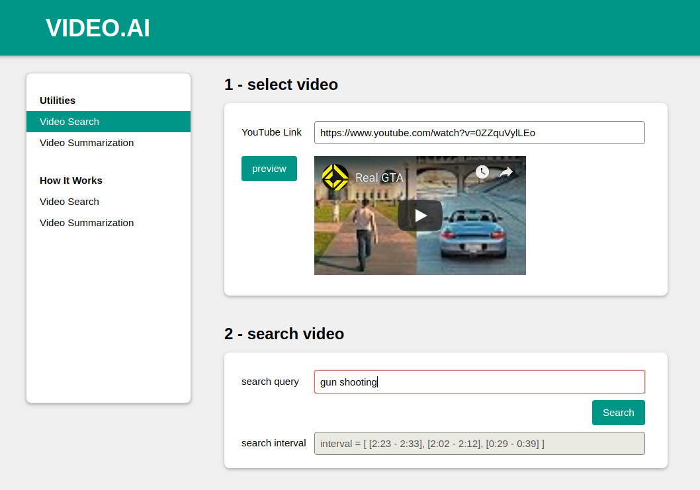
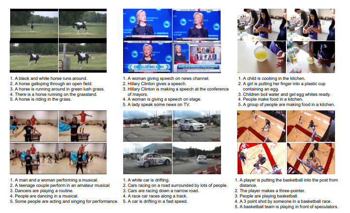
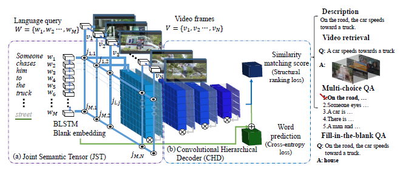

# Multimedita Question Answering

Increasing trend in the research community for video processing using artificial intelligence.
Trending Tasks:
- Video classification.
- Video content description.
- Video question answering (VQA).

# Main Idea

The main idea of the project is that searching for partition of video which is most relevent to a corresponding query "Question".

# Examples

# Dataset

We use the Microsoft Research Video to Text (MSR-VTT) dataset.
Example of the dataset is shown below.

  

# Architecture

Here is the base architecture which is used in paper [here](https://arxiv.org/abs/1808.02559).

  

# Authors

* [Amr Hendy](https://github.com/AmrHendy)
* [Muhammed Ibrahim](https://github.com/MuhammedKhamis)
* [Abdelrahman Yasser](https://github.com/Abdelrhman-Yasser)
* [Mohammed Shaban](https://github.com/mohamed-shaapan)
* [Arsanuos](https://github.com/Arsanuos)
* [Ahmed Ezzat](https://github.com/AhmedMaghawry) 

# Contribute

Contributions are always welcome!

Please read the [contribution guidelines](contributing.md) first.

# License

This project is licensed under the GNU General Public License v3.0 - see the [LICENSE](LICENSE) file for details

