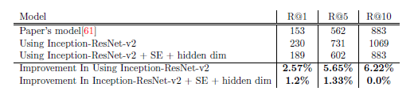
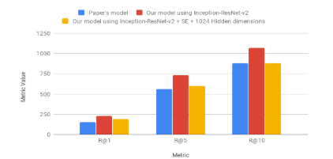

# Multimedita Question Answering

Increasing trend in the research community for video processing using artificial intelligence.
Trending Tasks:
- Video classification.
- Video content description.
- Video question answering (VQA).

# Main Idea

The main idea of the project is that searching for partition of video which is most relevent to a corresponding query "Question".
Instead of watching the complete video to find the interval you want to watch, you will give our model the video and the query which describes the part you want, then our model will give you the intervals sorted by relevance to the given query.

# Examples

# Dataset

We use the Microsoft Research Video to Text (MSR-VTT) dataset.
Example of the dataset is shown below.

  

# Extracted Visual Feature
We extracted the visual features of the data set using 3 different models.

* ResNet-152 (like paper): [gdrive link](https://drive.google.com/drive/folders/16EANa7XI-pX9vjJJCpQXZeVfHGBIGird?usp=sharing)

* Inception-ResNet-v2: [gdrive link](https://drive.google.com/drive/folders/1X7l0Uc2dij0RZDXfizOZYc1EyRwjfxxG?usp=sharing)

* NASNet: [gdrive link](https://drive.google.com/drive/folders/1-NkhaeHWdrQjdSRhqVVcYCXvZV6vp0tw?usp=sharing)

# Architecture

Here is the base architecture which is used in paper [here](https://arxiv.org/abs/1808.02559).

  

# Checkpoints

We have trained the model using different visual features extractors and changed a bit in the model architecture.

* Using ResNet visual features extractor (like paper): [gdrive link](https://drive.google.com/open?id=11QgK_WM1QUM6-R6FLLDcBxSh1Aj9H13j)

* Using NASNet visual features extractor: [gdrive](https://drive.google.com/open?id=1ulXiHvIg3fZ4xrXIGfUQto84E8oEbBz0)

* Using Inception-ResNet-v2 visual features extractor: [gdrive link](https://drive.google.com/drive/folders/1KHUDPItXL3b0s7ojTZadoObVGX4yFvkw?usp=sharing)

* Using Squeeze and Excitation technique with Inception-ResNet-v2: [gdrive line](https://drive.google.com/open?id=1bB9YenRh-VTFORoBzKBP48028soODyd7)

* Using Dropout technique: [gdrive link](https://drive.google.com/drive/folders/1bSXXHPSpg7jSkC2fUpe86R5naL4CZoHI?usp=sharing)

* Using Squeeze and Excitation along with Dropout: [gdrive link](https://drive.google.com/drive/folders/1-6Av792Htkal_sp9lM_7PwbwGCrejKaE?usp=sharing)

* Using Squeeze and Excitation technique and increasing hidden dimension of the LSTMs: [gdrive link](https://drive.google.com/drive/folders/1XZISh3Jg24jMuChZ5ChOb1kgvOEns2fC?usp=sharing)

# Results

From the results obtained in the explained experiments,  we found out that the best results obtained are from using Inception-ResNet-v2 as feature extractor for the visual features. Our model outperforms the original paper model in all used metrics as shown in the following table:

  

These results obtained from testing on the test set which contains 2990 videos.

You can see the comparison between all models in the following figure:

  

# Authors

* [Amr Hendy](https://github.com/AmrHendy)
* [Muhammed Ibrahim](https://github.com/MuhammedKhamis)
* [Abdelrahman Yasser](https://github.com/Abdelrhman-Yasser)
* [Mohammed Shaban](https://github.com/mohamed-shaapan)
* [Arsanuos](https://github.com/Arsanuos)
* [Ahmed Ezzat](https://github.com/AhmedMaghawry) 

# Contribute

Contributions are always welcome!

Please read the [contribution guidelines](contributing.md) first.

# License

This project is licensed under the GNU General Public License v3.0 - see the [LICENSE](LICENSE) file for details

